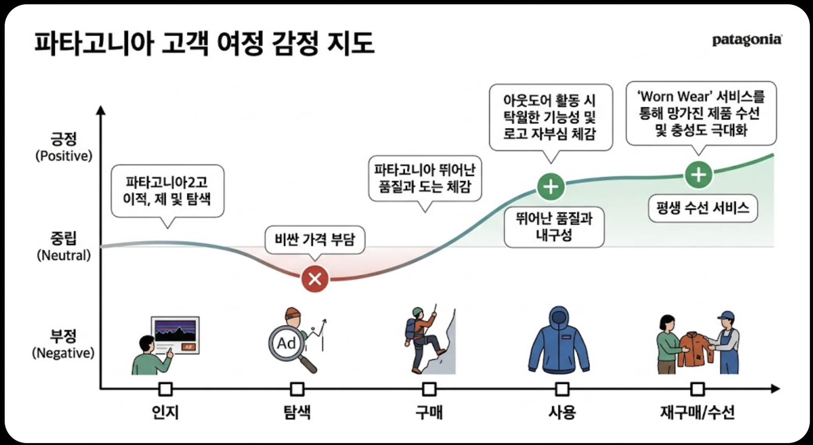

## [실습] 페르소나 카드 및 여정맵 시각화

<aside>
🗻 배웠던 내용을 활용하여 브랜드 **“파타고니아 (Patagonia)”의 페르소나 카드와 고객 여정맵을 시각화** 해보겠습니다.

템플릿에 맞게 내용을 하나씩 천천히 채워주세요. 가끔 ChatGPT로 데이터를 시각화하는데 오류가 나타나기도 합니다. 그럴때에는 ChatGPT와 어떻게 픽스할 수 있을지 소통하며 계속 시도해주시면 됩니다. 

<aside>
1️⃣

**페르소나 카드 작성**

| 항목 | 설명 |
| --- | --- |
| 이름 / 나이 |  |
| 직업 / 소득 |  |
| 라이프스타일 |  |
| Pain Point |  |
| Needs |  |
| 구매동기 (브랜드 선택 요인) |  |
| 행동패턴 (채널) |  |
| 감정선 |  |
| 브랜드 인식 |  |
</aside>

<aside>
2️⃣

**고객 여정맵** 

| 단계 | 고객 행동 | 감정(긍정/부정) | 브랜드 터치포인트 | Pain Point / Delight Point | 개선 전략 |
| --- | --- | --- | --- | --- | --- |
| **인지**  |  |  |  |  |  |
| **탐색**  |  |  |  |  |  |
| **구매**  |  |  |  |  |  |
| **사용**  |  |  |  |  |  |
| **재구매**  |  |  |  |  |  |
</aside>

<aside>
3️⃣

**고객 여정맵 시각화** 

ChatGPT를 사용하여 고객 여정맵을 이미지로 제작해봅시다. 

---

# 파타고니아(Patagonia) 페르소나 및 고객 여정 맵 보고서

## 1. 페르소나 카드 (Persona Card)

**"지구를 구하기 위해 사업을 하는 에코 어드벤처러"**

| 구분 | 내용 |
| :--- | :--- |
| **인적 사항** | **이름:** 김지후 (34세) / **직업:** IT 스타트업 서비스 기획자 |
| **관심사** | 주말 백패킹, 클라이밍, 제로 웨이스트, 미니멀리즘, 지속 가능한 패션 |
| **라이프스타일** | 단순한 소비보다 가치 있는 소유를 지향하며, 자연과 공존하는 삶을 실천함 |
| **Pain Point** | 유행에 따라 쉽게 버려지는 패스트 패션의 환경 파괴, 기능성은 좋으나 유해 소재를 사용하는 제품들 |
| **Needs** | 평생 입을 수 있는 내구성, 투명한 공급망, 브랜드의 진정성 있는 환경 보호 행보, 수선(Repair) 서비스 |
| **구매 동기** | "환경을 위해 이 재킷을 사지 마세요"와 같은 파격적인 철학에 공감. 단순 구매가 아닌 환경 운동 동참 |
| **행동 패턴** | 인스타그램 친환경 커뮤니티 활동, 유튜브 장비 리뷰 분석, 파타고니아 오프라인 매장 방문 체감 |
| **브랜드 인식** | 단순 의류 브랜드가 아닌, 사회적 책임을 다하는 '롤모델 기업'으로 인식하며 강력한 팬덤 형성 |

### [구매 행동 흐름]
1. **인지:** SNS 캠페인이나 환경 다큐멘터리를 통해 브랜드의 철학을 처음 접함.
2. **탐색:** 소재(오가닉 코튼, 리사이클 폴리에스터)의 출처와 공정무역 인증 여부를 꼼꼼히 확인.
3. **구매:** 높은 가격대에 잠시 고민하지만, 장기적인 내구성과 가치 소비 관점에서 결제.
4. **사용:** 실제 거친 아웃도어 환경에서 뛰어난 기능성을 체감하며 로고에 대한 자부심을 느낌.
5. **재구매/수선:** 제품 파손 시 'Worn Wear' 서비스를 통해 수선하며 브랜드와 정서적 유대감 강화.

---

## 2. 고객 여정 맵 (Customer Journey Map)

| 단계 | 인지 (Awareness) | 탐색 (Consideration) | 구매 (Purchase) | 사용 (Usage) | 재구매/수선 (Loyalty) |
| :--- | :--- | :--- | :--- | :--- | :--- |
| **고객 행동** | 환경 캠페인 광고 접촉 | 소재 및 가격 비교 분석 | 온/오프라인 제품 결제 | 등산/캠핑 시 실착용 | 수선 신청 및 신제품 탐색 |
| **감정 상태** | 긍정 (감동) | 중립 (고민) | 긍정 (결단) | 매우 긍정 (만족) | 최고조 (신뢰) |
| **터치 포인트** | 인스타그램, 유튜브 | 공식 홈페이지, 블로그 | 도산점 매장, 웹사이트 | 필드(산, 암벽 등) | Worn Wear 센터 |
| **Pain Point** | - | **(X) 높은 가격대** | 결제 과정의 번거로움 | - | - |
| **Delight Point** | 브랜드 철학 공감 | - | 친환경 패키징 | **(+) 품질 및 내구성** | **(+) 평생 수선 서비스** |
| **개선 전략** | 진정성 있는 스토리텔링 지속 | 가격 정당성(LTV) 홍보 | 구매 경험 간소화 | 커뮤니티 이벤트 개최 | 수선 인프라 확대 |

---

## 3. 시각화 지표 요약

- **X축 (단계):** 인지 → 탐색 → 구매 → 사용 → 재구매/수선
- **Y축 (감정):** 부정 → 중립 → 긍정
- **주요 표시:** - **탐색 단계:** 가격 부담으로 인한 일시적 감정 하락 (Pain Point: 빨간 X)
    - **사용/재구매 단계:** 탁월한 기능성과 수선 서비스로 인한 감정 상승 (Delight Point: 초록 +)

---
*본 문서는 파타고니아 브랜드의 타겟 고객 분석을 위해 작성되었습니다.*
