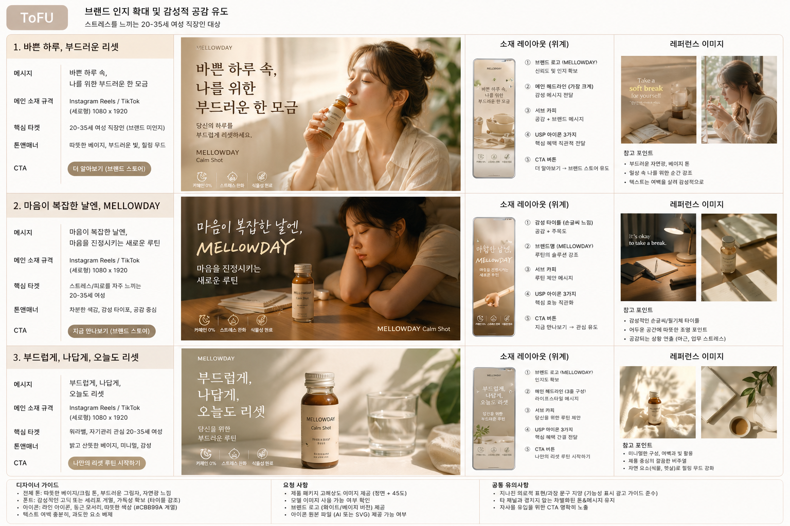
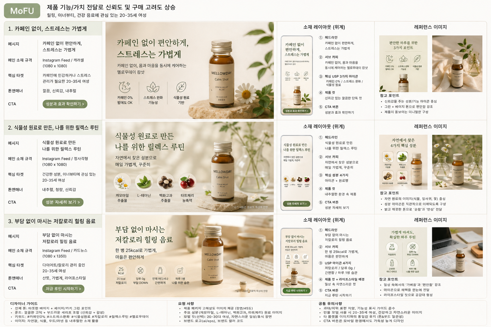
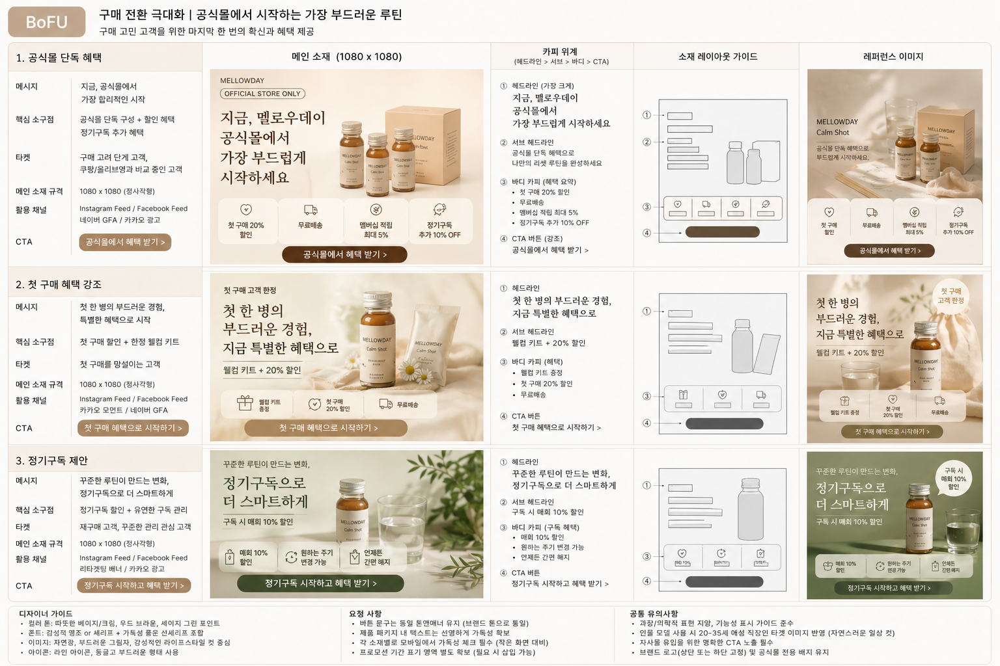

## 5. [실습] AI를 활용한 크리에이티브 브리프 작성

💡 배운 내용을 활용하여 AI와 함께 크리에이티브 브리프를 작성해봅시다.

여러분은 가상의 브랜드 **“멜로우데이(Mellowday)”**의 마케터이며, 신규 제품 런칭을 앞두고 있습니다. 

**신규 제품 인지도 상승과 제품 판매 활성화**를 위한 크리에이티브 브리프를 작성해봅시다. 

🫖 **멜로우데이** 

“바쁜 하루 속, 나를 위한 부드러운 한 모금”

---

- **제품군:** 기능성 음료 (이너뷰티 & 스트레스 완화 음료)
- **핵심 제품:**
    - *MELLOWDAY Calm Shot* : 스트레스 완화 미니드링크
- **타겟:** 20–35세 여성 직장인, 자기계발과 워라밸에 관심 있는 MZ세대
- **USP (차별점):**
    - 카페인 없이 ‘릴렉스, 스트레스 완화’ 두 가지 기능을 동시에
    - 식물성 원료 기반 / 저칼로리
    - 감성적인 패키징과 브랜딩 (따뜻한 베이지톤, 힐링 메시지)
    - 합리적 가격 (시중의 에너지 드링크와 비슷한 가격대 형성)
- **핵심 메시지:**
    
    > “당신의 하루를 부드럽게 리셋하세요.
    MELLOWDAY — 마음을 진정시키는 새로운 루틴.”
    > 

1️⃣ **타겟 오디언스, 소구점, 메시지, 채널, 규격 선정** 

| 타겟 오디언스 | 소구점 | 메시지 | 채널 | 규격 | 총 수량 |
| --- | --- | --- | --- | --- | --- |

2️⃣ **소재 기획 및 소재 초안 제작** 

초안은 총 3종으로 제작해주세요. 

3️⃣ **최종 크리에이티브 브리프 제작**

구글 슬라이드, Figma를 활용하여 직접 제작하시거나, AI를 활용해서 제작해주시면 됩니다. 

---

# 1️⃣ 타겟 오디언스, 소구점, 메시지, 채널, 규격 선정 

| 타겟 오디언스 | 소구점 | 메시지 | 채널 규격 | 총 수량 |
|-------------|------|------|---------|--------|
| ToFU: 스트레스/피로를 느끼는 20–35세 여성 직장인 (브랜드 미인지) | 감성 브랜딩 + ‘하루 리셋’ 라이프스타일 제안 | “바쁜 하루 속, 나를 위한 부드러운 한 모금” / “당신의 하루를 부드럽게 리셋하세요” | SNS 숏폼 영상 (Reels/TikTok 15초), 유튜브 범퍼 (6초), 디스플레이 배너 | 6–8종 |
| MoFU: 힐링, 이너뷰티, 건강 음료 관심층 (제품 탐색 단계) | 카페인 無 + 스트레스 완화 기능 + 식물성/저칼로리 USP | “카페인 없이 편안하게, 스트레스는 가볍게” / “부담 없이 마시는 릴렉스 루틴” | 인스타 피드/캐러셀, 유튜브 인스트림 (15–30초), 네이버 GFA | 5–6종 |
| BoFU: 구매 고려 및 비교 단계 (쿠팡/올리브영 vs 자사몰 고민층) | 자사몰 혜택 강조 (단독 구성, 할인, 정기구독 등) + 감성 패키징 | “지금, 멜로우데이 공식몰에서 가장 부드럽게 시작하세요” / “첫 구매 혜택으로 나만의 리셋 루틴 완성” | 리타겟팅 배너, 카카오/메타 전환 캠페인, 랜딩 최적화 콘텐츠 | 4–5종 |

# 2️⃣ 소재 기획 및 소재 초안 제작 

